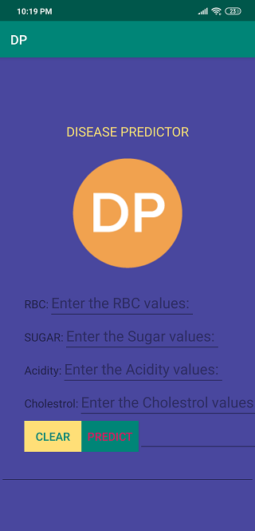

# Disease_Predictor_Android_App

# Purpose
   1) To act as an artificial doctor to predict the high probable or possible diseases that the user could acquire or might have currently been affected with.
   2) To suggest him food he must avoid for the disease that had been predicted.
   
# Screen-Shots
   
   # 1) User-Interface        #  2) Entering Parameters
                

 

  
  #  3) Predicted Disease &  #  4) Clean State 
  #       Suggested Foods        
  
  
 
  
   # Directly clone the project using android studio and run it on your device !!!!!!!!!!!
   
       Refer this link for cloning the project directly using Android Studio : https://www.youtube.com/watch?v=k4xfd1iVKMo
   
